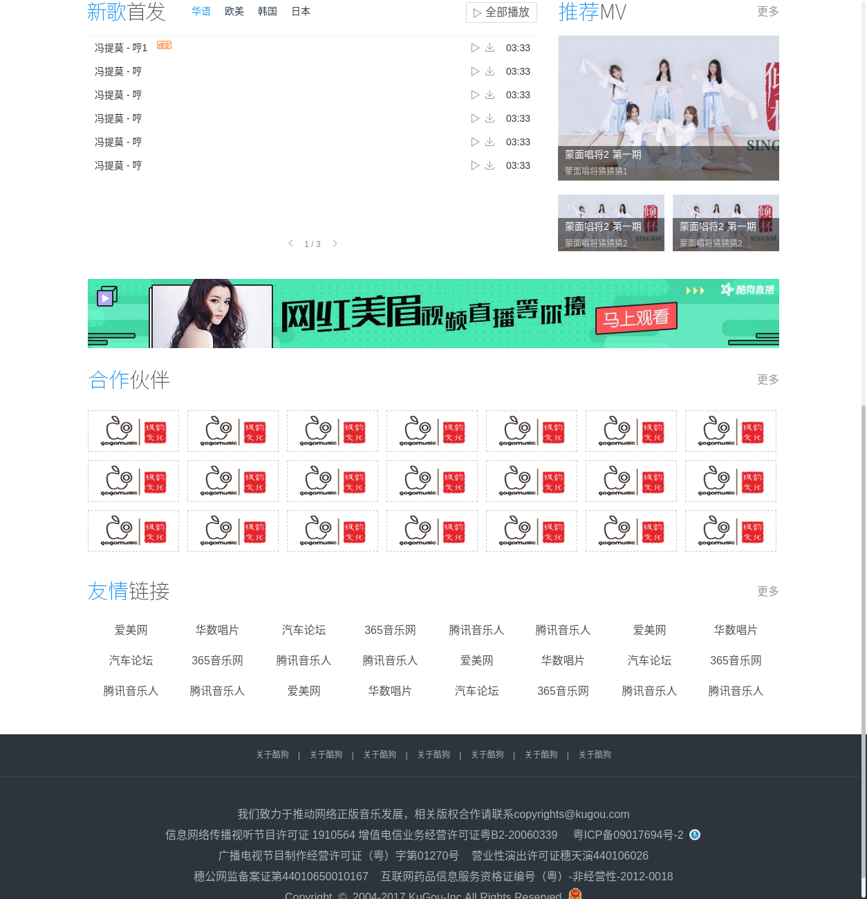
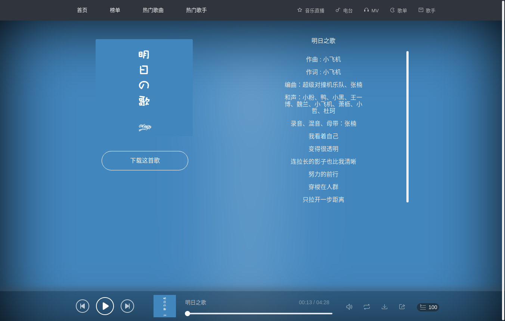
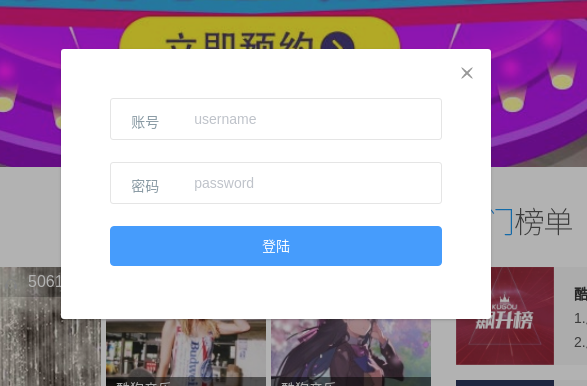
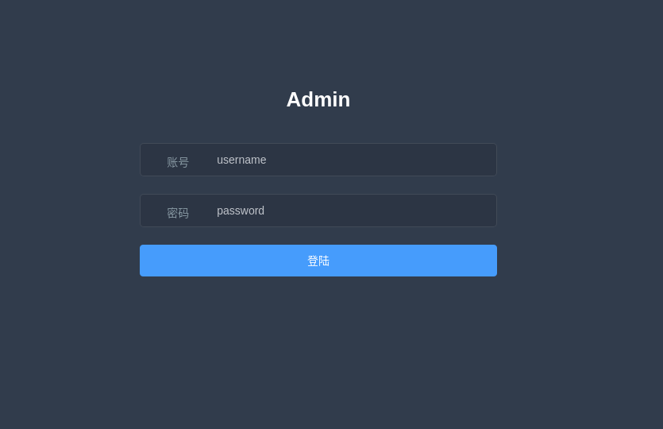
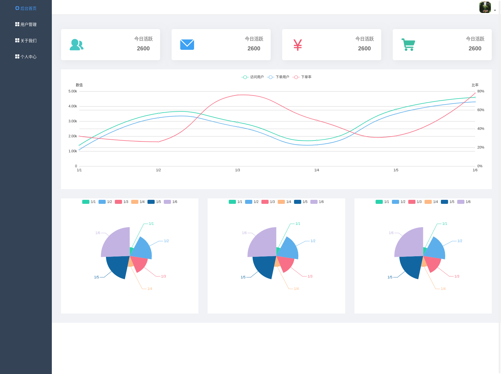
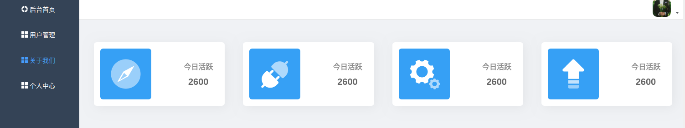

# My-music

<a href="https://github.com/xiaotiandada">
  
</a>

<a href="https://github.com/xiaotiandada">
  
</a>

---

根据很久以前模仿酷狗音乐首页的练习静态页面改成vue的网站

主要显示在pc端 移动端未作处理 建议使用最新浏览器浏览

个人练手项目(也是叫期末作业2333～！～)

> [在线演示地址](http://123.207.60.132:8081/)

> [项目文章地址](https://juejin.im/post/5b2c92c651882574d87a9429)


## installation

> download

``` bash
# cloen
git clone https://github.com/xiaotiandada/My-music.git

# cd app
cd My-music
```

> front-end

```bash
# cd clinet
cd client

# install dependencies
npm install

# serve with hot reload at localhost:8080
npm run dev

```

> rear-end

```bash
# cd service
cd service

# install dependencies
npm install

# serve with hot reload at localhost:8081
supervisor app.js or node app.js or pm2 app.js
```

## 技术栈

- Vue-Cli
- Vue
- Vue-Router
- Vuex
- ES6
- Less
- Axios
- v-charts
- element-ui
- lodash
- normalize
- vodal
- vue-gemini-scrollbar
- vue-lottie
- vuex-persistedstate
- vuex-router-sync
- ---
- bcryptjs
- body-parser
- cors
- express
- jsonwebtoken
- mongodb
- mongoose
- morgan
- passport
- ......


> 还有一些别的工具 详情大家看package.json配置文件即可

## 项目目录

```bash
# 描述一些主要的文件
├── client                      // 前端项目文件
│    ├── src                    // 项目源码目录
│        ├── assets             // 资源目录
│        ├── components         // 项目公共组件
│        ├── icon               // 项目icon图标
│        ├── pubilc             // 项目共有资源
│        ├── router             // 项目路由
│        ├── services           // 项目api请求封装
│        ├── store              // 项目状态管理
│        ├── views              // 项目视图
│            ├── admin          // 项目后台管理
│            ├── content        // 项目首页内容
│            ├── errorPage      // 项目错误页面
│            ├── Footer         // 项目页脚
│            ├── Header         // 项目头部
│            ├── Login          // 项目登录
│            ├── Nav            // 项目导航
│            ├── Registered     // 项目注册
│            ├── Slider         // 项目轮播图
│            ├── Song           // 项目歌曲
├── service                     // 后台项目文件
│   ├── config                  // 后台配置信息
│   ├── controllers             // 后台控制器
│   ├── model                   // 数据库模型
│   ├── router                  // 后台路由    
```


## 界面展示














## 更新说明

### v1.0.0

- 基础功能实现和页面展示

## 参考内容或文章

- [网易云音乐 Node.js API service](https://github.com/Binaryify/NeteaseCloudMusicApi)
- [Vue-mmPlayer](https://github.com/maomao1996/Vue-mmPlayer)
- [vue-element-admin](https://github.com/PanJiaChen/vue-element-admin)
- [tab-tracker](https://github.com/codyseibert/tab-tracker)
- [Vue全家桶打造自适应 web 音乐播放器](https://juejin.im/post/5afcdc73518825428630b216)
- [https://juejin.im/entry/5b0567c8f265da0b7d0bbf34/detail](https://juejin.im/entry/5b0567c8f265da0b7d0bbf34/detail)
- [优雅的提交你的 Git Commit Message](https://juejin.im/post/5afc5242f265da0b7f44bee4)
- [手摸手，带你用vue撸后台 系列](https://juejin.im/post/59097cd7a22b9d0065fb61d2)
- 还有的就记不得了哈哈哈哈海

## 关于

- 个人练手项目 (产品内容还是不符合规范的QAQ)
- 如果您觉得还是不错的话 可以点点 Star 谢谢2333
- 后续有空继续更新
- 如果有问题可以直接在Issues提出来 或 加我Q私信(952822399)


## License

This project is licensed under the MIT License - see the [LICENSE.md](LICENSE.md) file for details